# nostr-webhook-vercel

[Nostr演習](https://github.com/nostr-jp/learn-nostr-by-crafting)で作成したBOTを24時間動かしたい人向けのものです。  
[nostr-webhook](https://github.com/mattn/nostr-webhook)がアクセスするエンドポイントを[Vercel](https://vercel.com/)で作成します。

## 必要なもの

1. GitHubアカウント
2. Vercelアカウント
3. nostr-webhook の利用登録

各種サービスのアカウント登録についてはここでは説明しません。  
VercelはGitHubアカウントで連携してログインできるので便利です。  
nostr-webhook については [@mattn](https://github.com/mattn) さんにお願いして利用登録の申請をしましょう。  
その際 [@nostr-jp](https://github.com/nostr-jp) のメンバーとして登録される必要があります。

## リポジトリの準備

現在あなたが見ているリポジトリがテンプレートとなっています。  
このテンプレートを基に自分のリポジトリを作成してください。  
（プロジェクト名は自分のBOTのものとわかるような名前に変えてください）  
右上の緑のボタン`Use this template`から`Create a new repository`を選択します。  
自身のリポジトリができたら自分のローカルPCの適当なディレクトリに`git clone`してください。  
個人的に[GitHub Desktop](https://desktop.github.com/)を使うのがおすすめです。

## Vercelにデプロイ

リポジトリができたらVercelにデプロイします。  
GitHub連携でVercelにログインしてください。

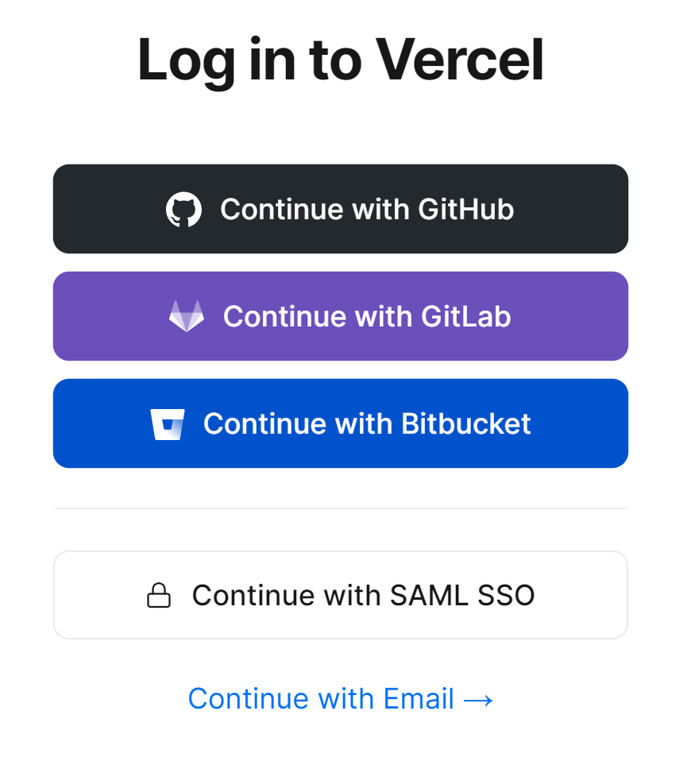

Add New... から Project を選択します。

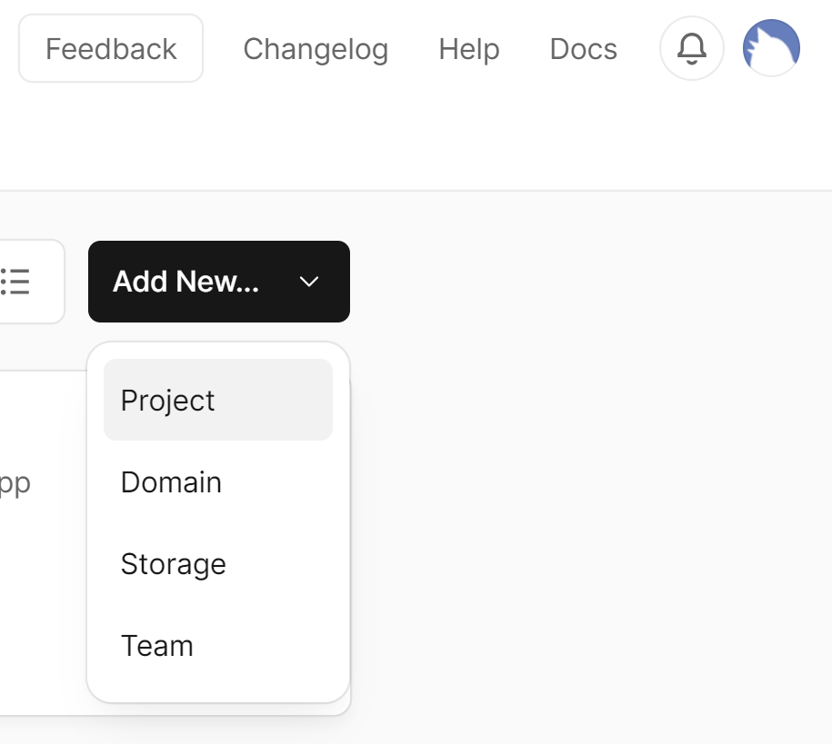

対象のリポジトリを Import します。

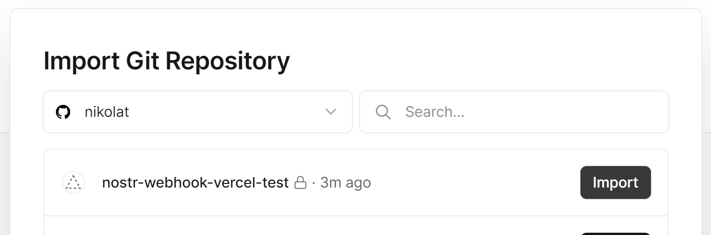

そのまま何も考えずDeployします。

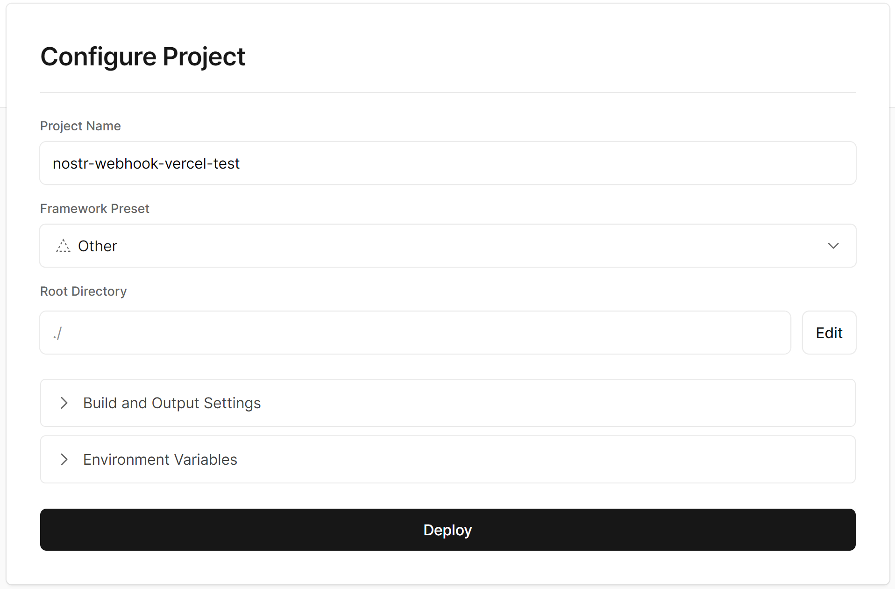

おめでとうございます。Continue to Dashboardへ進みましょう。

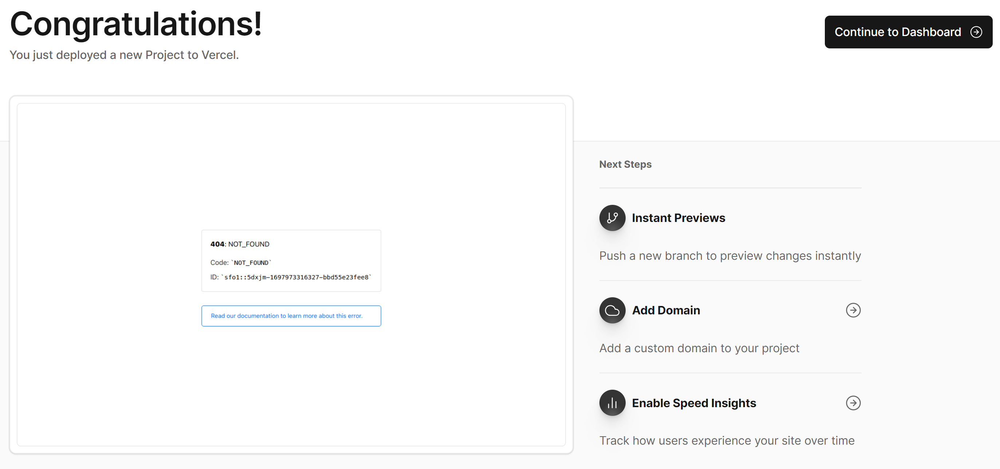

サブドメインを変更したい場合はDomainsへ進みます。

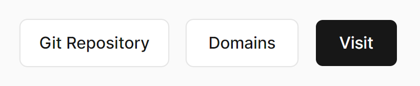

空いてるサブドメインがあればEditで変更できます。

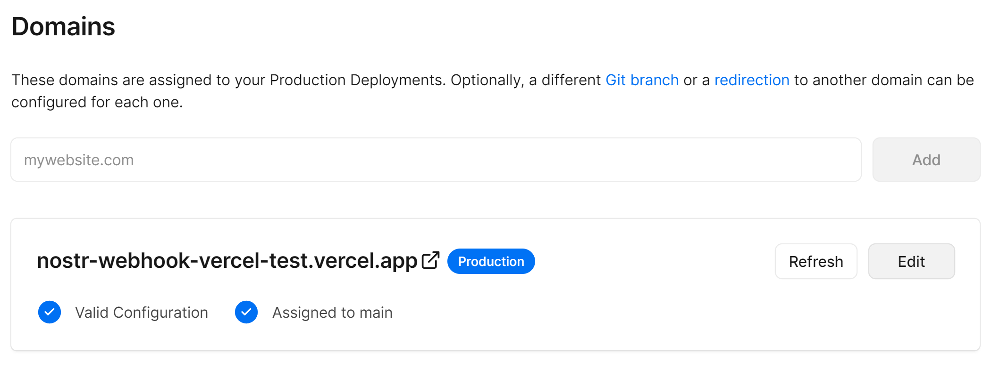

さて、BOTの秘密鍵を環境変数に登録しましょう。Environment Variablesに進みます。

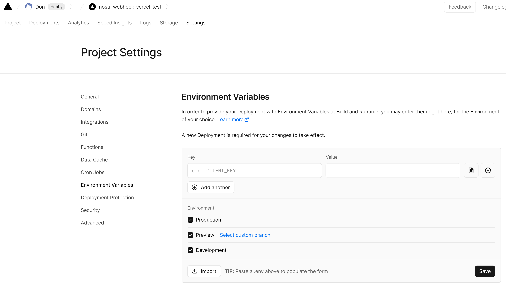

`Key`に`NOSTR_PRIVATE_KEY`、`Value`にBOTの秘密鍵を入力して保存してください。

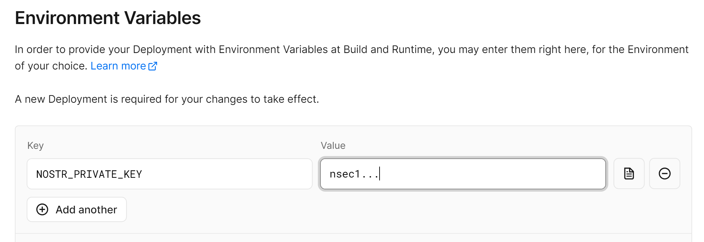

これで準備が整いました。  
Webブラウザで `https://<your-subdomain>.vercel.app/api/sample` にアクセスしてみてください。  
`Method Not Allowed`と表示されるはずです。

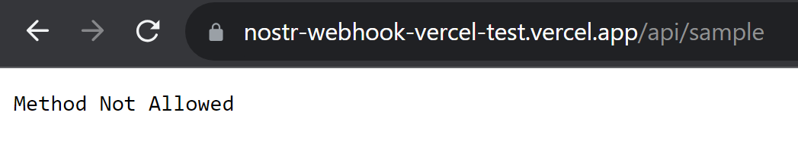

イベントのJSONをPOSTメソッドで送信しないと正しいレスポンスは返りません。  
以下のイベントを`input.json`という名前でプロジェクトのルートディレクトリに保存してください。

```json
{
  "kind": 1,
  "created_at": 1698055919,
  "content": "#ノス禁",
  "tags": [
    [
      "t",
      "ノス禁"
    ]
  ],
  "pubkey": "b27ce6ac627614a3f0f6bac3f1397ca32173abcb852a2624b6d8d7618200f37c",
  "id": "26e1ad86e6e60f1725392c049b17695e7457d0a091ea659ac51aefc180c58b12",
  "sig": "4408409ba3be60e161b86b032797254399a3cf3caec2edd19602aacc96423ffc167fb894c74d0627205eb53bcaa70dbfc3556be2d166401b42f6d08ce2e2df95"
}
```

コマンドプロンプトでプロジェクトのルートディレクトリに移動し、以下のコマンドを入力してください。

```bat
curl -X POST -H "Content-Type: application/json" -d @input.json https://<your-subdomain>.vercel.app/api/sample
```

`𝑫𝒐 𝑵𝒐𝒔𝒕𝒓`と返すイベントが表示されたら成功です。  
もし`NOSTR_PRIVATE_KEY is undefined`というエラーが返ってきたらRedeployを試してみてください。

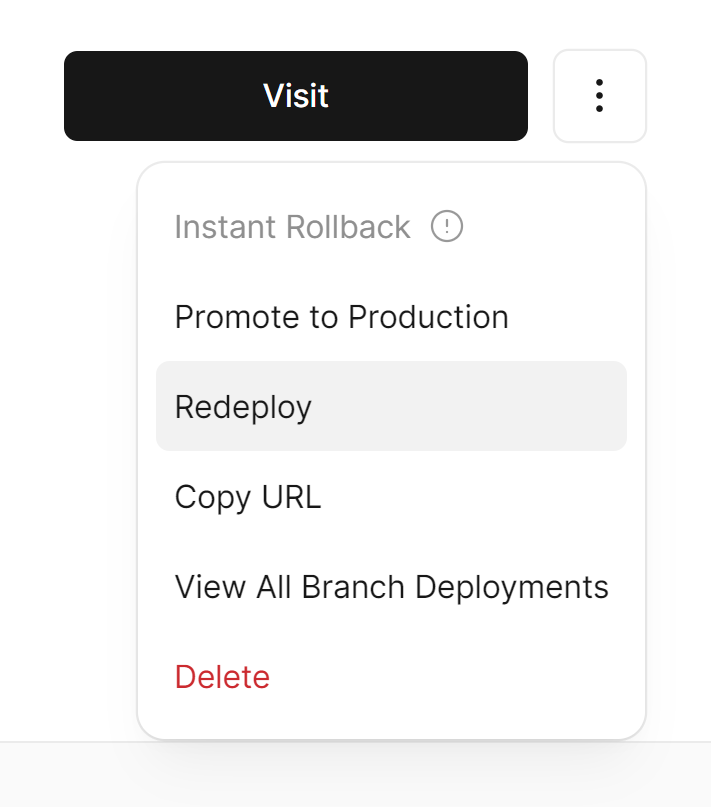

以上でVercelの設定は完了です。  
あとは自分のBOTのキャラクターに合うように、 [src/response.js](src/response.js) を編集してみてください。

## nostr-webhookの設定

nostr-webhook でフックしたいイベントを登録します。

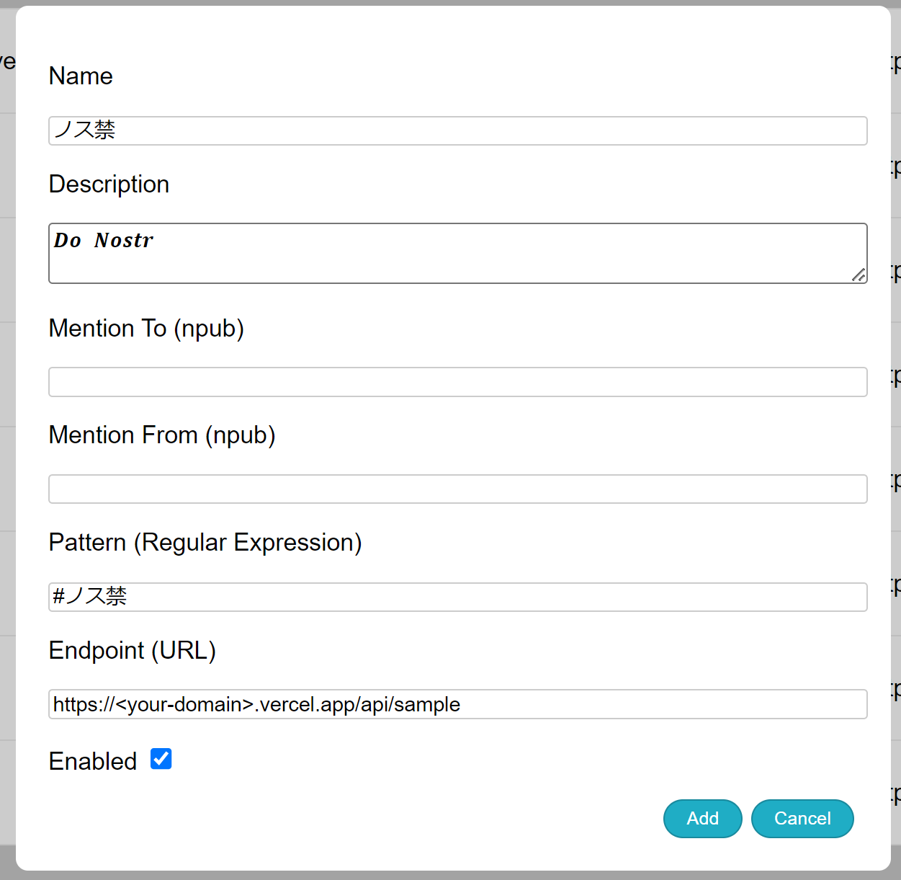

以上で nostr-webhook の設定は完了です。  
エンドポイントを増やす場合は、併せてプロジェクトにも `api/sample.js` をコピーして `api/<new-endpoint-name>.js` を作成してください。

## 不要なファイルの削除

以下のファイルは不要なので削除してください。

- [LICENSE](LICENSE)
- [README.md](README.md)
- image/*.png

## ローカルでのデバッグ

下準備としてプロジェクトのルートディレクトリで `npm install` を実行してください。  
（[nostr-tools](https://github.com/nbd-wtf/nostr-tools)が使えるようになります）  
`node main.js` コマンドで [main.js](main.js) が実行されます。  
適当な入力値を設定しつつ期待した response が返るまで [src/response.js](src/response.js) を修正していく感じで開発してください。
